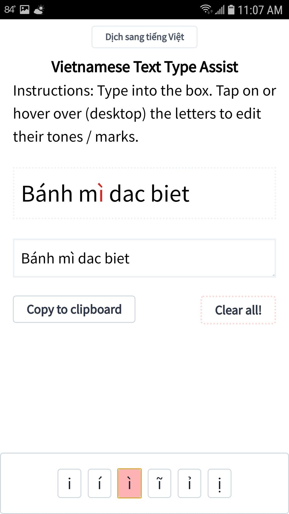

# Vietnamese Type Assist

A PWA for typing out Vietnamese characters without using a soft or emulated keyboard. All of the tones and diacritic marks are presented as handy UI buttons. Good for quickly punching in a phrase or a few words without needing to switch to TELEX or another Vietnamese keyboard.

Hosted by Github at https://nguyenmichael.dev/viet-type-assist/

## Usage

Type into the indicated box. Your text will appear in the display box. On Web, hover over the letters which have tone or diacritic marks (a, e, i, o, u, d) and select your choice of tone and diacritic combination. On mobile, press the letter and a selection box will appear. When finished, tap or click "Copy to clipboard" and paste your words/phrases where ever you'd like!

  
  
  
  
  
  

### Progressive Web App

This is purely front-end code and has service workers set up for offline use on mobile devices. Most browsers will allow download/save to device for offline use. Find it in the menu.

## Built With

* [React](https://github.com/facebook/react) - Reactive front-end library
* [Tailwind](https://github.com/tailwindcss/tailwindcss) - CSS Utility library

## Story

I had a couple of motivations to build this, chiefly:

* Realizing the frustration of Overseas Vietnamese populations (mostly being English speakers) in learning to read and write in their mother tongue
  
  The diacritics and a general lack-of-self-confidence brought on by the hopelessness of learning to write and read Vietnamese causes a sort of feedback loop, reducing motivation to learn and making it more of a struggle. I can't fix both of those problems but I can fix one of them!

* Realizing that resources for typing in Vietnamese are either hidden or cumbersome

  Typing in Vietnamese requires many special marks layered upon the Latin alphabet for identification of tones: `a vs. á vs. à` for example or for disambiguation of similar characters (something I wish English did!): `a vs. â vs. ă`. These may then be stacked upon each other: `ằ`. The most common vietnamese keyboard is TELEX, and that works fantastic on mobile devices: the iOS and Android implementation is fantastic. However, one has to find it in the settings and download it. The Windows implementation on the otherhand has some quirks that make it difficult to use.

I decided I wanted to practice my Bare Bones Basic React and hopped in and wrote this, mostly in pure basic JSX and styled with Tailwind. 

Whether this truly provides utility, I do not know. It's better to just learn the TELEX system, however, it might be useful for marking tones on small passages or phrases without wading through the quirks of a digital TELEX keyboard. (Example quirks are like "what does backspace do?", will it delete the whole character or the last tone?)

I've learned a lot creating this, and it can be better! Right after I created this with the traditional React 15 style state handling, I learned state is now handled with 'Hooks'. This app could be refactored with Hooks! I learned how to set up a PWA and get icons up and running. This is all very handy info and I'm glad I jumped in and created this.
